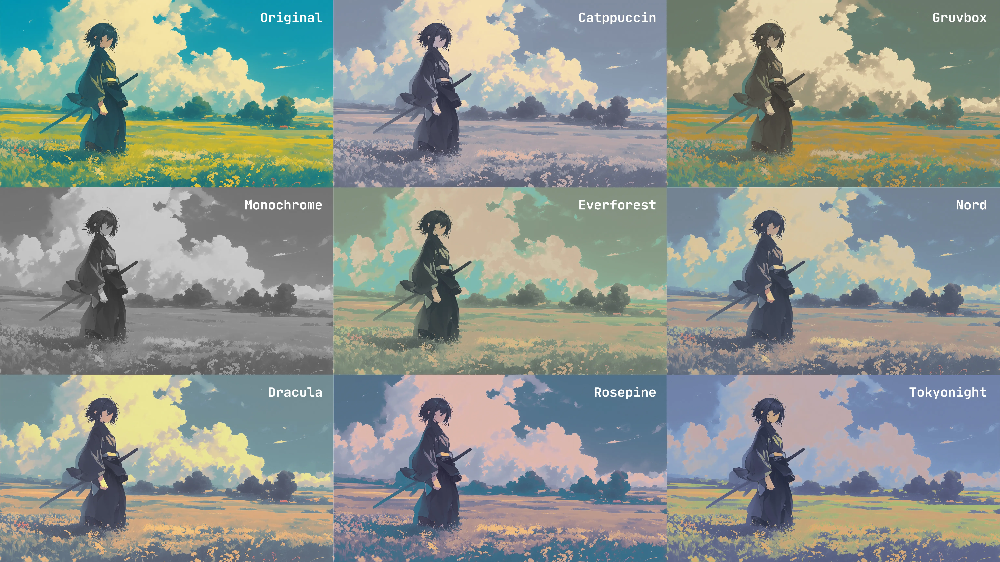

<h1 align="center">🎨 tint</h1>

<p align="center">
  
</p>

<div align="center">
<p>
<a href="https://github.com/ashish0kumar/tint/stargazers"><a>&nbsp;&nbsp;
<a href="https://github.com/ashish0kumar/tint/"></a>&nbsp;&nbsp;
<a href="https://github.com/ashish0kumar/tint/releases"></a>&nbsp;&nbsp;
<a href="https://github.com/ashish0kumar/tint/blob/main/LICENSE"></a>&nbsp;&nbsp;
</p>
</div>

<br>
<div align="center">

</div>

<br>

`tint` is a command-line tool to **recolor images using your favorite theme palettes**. It's designed for those who appreciate a cohesive visual aesthetic, letting you match your wallpapers or other images to your favorite themes.

---

## Features

- **Theme-Based Recoloring:** Apply color palettes from themes like Catppuccin, Nord, Gruvbox, and many more.
- **Smooth Color Transitions:** Uses Shepard's Method for natural gradients and blends in complex images.
- **Luminosity Adjustment:** Easily fine-tune the brightness of your recolored images.
- **Customizable Interpolation:** Control blending by adjusting `nearest` colors and weighting function `power`.
- **Image Format Support:** Works with JPEG and PNG image files.
- **Efficient Processing:**  Leverages Go's concurrency for quick processing, especially for large images.
- **Lightweight & Dependency-Free:** A single, self-contained Go binary with no external dependencies.

---

## Available Themes

| Theme       | Flavors                                        |
|-------------|------------------------------------------------|
| Ayu         | light, mirage, dark                            |
| Catppuccin  | frappe, latte, macchiato, mocha                |
| Dracula     | default                                        |
| Everforest  | dark, light                                    |
| Gruvbox     | dark, light                                    |
| Kanagawa    | dragon, lotus                                  |
| MonokaiPro  | classic, spectrum, octagon, machine, ristretto |
| Monochrome  | default                                        |
| NightOwl    | default                                        |
| Nord        | default                                        |
| RosePine    | dawn, main, moon                               |
| Solarized   | dark, light                                    |
| Tokyonight  | light, night, storm                            |

---

## Installation

### Arch Linux (AUR)

```bash
yay -S tint
```

### Nix

```bash
nix profile install nixpkgs#tint
```

### Void Linux

```bash
sudo xbps-install -S tint
```

### Install via `go install`

Ensure your Go environment is set up (`GOBIN` is in your `PATH`), then run:

```bash
go install github.com/ashish0kumar/tint@latest
```

### Build from Source

Clone the repo, build the project and move it inside your `$PATH`:

```bash
git clone --depth=1 https://github.com/ashish0kumar/tint
cd tint
go build
sudo mv tint /usr/local/bin/
tint -h
```

---

## Usage

```yaml
Usage: tint --image <IMAGE> --theme <THEME-FLAVOR> [OPTIONS]

  --theme, -t <STRING>
        Theme palette and optional flavor (required).
        Use --list-themes to see all available themes and flavors.

  --image, -i <PATH>
        Path to the input image (required). Supports JPEG, PNG formats.

Options:

  --output, -o <PATH>
        Path for the output image.
        (Default: <input_filename>_themed_<theme-flavor>.<input_format>)

  --luminosity <FLOAT>
        Luminosity adjustment factor (e.g., 0.8 for darker, 1.2 for brighter).
        (Default: 1.0)

  --nearest <COUNT>
        Number of nearest palette colors to consider for interpolation.
        (Default: 30)

  --power <FLOAT>
        Power for Shepards Method (influences how quickly weights fall off).
        (Default: 2.5)

  --list-themes, -l
        List all available themes and their flavors.
        
  --not-open
        not open the recolored image in the default viewer

  --vesion, -v
        Check the version.

  --help, -h
        Print this help message.
```

> [!WARNING]
> **Memory Note**
>
> Processing large images (e.g., 50MP, ~7071x7071) can use significant RAM. <br>
> A 50MP image in RGBA format (4 bytes/pixel) may consume over 500 MiB of memory. <br>
> Ensure your system has enough free memory before running.

## Examples

```bash
# Recolor an image using the Catppuccin theme (default flavor)
tint --image input.jpg --theme catppuccin

# Use the Catppuccin theme's "latte" flavor and specify an output filename
tint -i image.png -t catppuccin-latte -o output_light.png

# Apply the Gruvbox theme and make the image slightly brighter
tint -i pic.jpeg -t gruvbox -o bright_pic.jpg --luminosity 1.2

# Recolor using Everforest theme with a smoother gradient (more nearest colors)
tint -i bg.png -t everforest --nearest 50

# Use Tokyonight theme and tweak the interpolation strength (Shepard's Method)
tint -i wallpaper.png -t tokyonight --power 3.5

# List all available themes and flavors
tint --list-themes
```

---

## Development

### Submitting New Themes

I'd love to expand `tint`'s theme collection! If you have a favorite theme not yet included, or want to contribute a new one, here's how:

1. **Understand the structure:**
    - Theme definitions live in the `themes/` directory. Each theme typically gets its own `.go` file (eg `themes/catppuccin.go`).

    - Colors are defined as `color.RGBA` values, usually converted from hexadecimal strings using the `hexToRGBA` helper function found in `themes/registry.go`

2. **Create your theme file:**

    - Create a new Go file in the `themes/` directory (eg `themes/mytheme.go`).

    - Inside this file, define a `map[string]map[string]color.RGBA` that holds your theme data.

        - The top-level key should be your theme's main name (eg `"mytheme"`).
        
        - The nested map contains flavors. If your theme has multiple flavors (eg dark/light variants), define them as sub-maps (eg `"dark": {...}, "light": {...}`).

        - **Crucially, every theme must include a `"default"` flavor**. This is the palette tint will use if no specific flavor is mentioned by the user when running the command (eg just `-t catppuccin` will pick `catppuccin-default`).
        
        - Map descriptive color names (eg `"base"`, `"surface0"`) to their `color.RGBA` values using `hexToRGBA`

    - **Example `themes/mytheme.go` structure:**
    
    ```Go
    package themes

    import "image/color"

    var MyTheme = map[string]map[string]color.RGBA{
        "default": { // Important
            "background": hexToRGBA("#282A36"),
            "foreground": hexToRGBA("#F8F8F2"),
            "comment":    hexToRGBA("#6272A4"),
            // ... more colors
        },
        "dark": {
            "base":     hexToRGBA("#1A1A1A"),
            "text":     hexToRGBA("#F0F0F0"),
            "accent":   hexToRGBA("#FF5733"),
            // ... more colors
        },
        "light": {
            "base":     hexToRGBA("#F0F0F0"),
            "text":     hexToRGBA("#1A1A1A"),
            "accent":   hexToRGBA("#337AFF"),
            // ... more colors
        },
    }
    ```

3. **Register your theme:**

    - Open `themes/registry.go`
    - Add your theme to the `AllThemeData` map.


    ```Go
    var AllThemeData = map[string]map[string]map[string]color.RGBA{
        // ... existing themes
        "mytheme": MyTheme, // Add this line
    }
    ```

4. **Validate and Test:**
    - Run `go build` from the project root to ensure there are no compilation errors.
    - Test your new theme using `tint -t mytheme-dark` (or `mytheme`) with an image to confirm it works as expected.

5. **Submit a Pull Request:**

    - Fork the repository.
    - Create a new branch for your changes.
    - Commit your new theme file and the changes to `themes/registry.go`
    - Open a Pull Request, explaining your new theme.

---

## Contributing

Contributions are always welcome! If you have ideas, bug reports, or want to submit code, please feel free to open an issue or a pull request.

## Acknowledgments

This project has been inspired by the work of others in the open-source community:

- [Achno/gowall](https://github.com/Achno/gowall)
- [ozwaldorf/lutgen-rs](https://github.com/ozwaldorf/lutgen-rs)
- [nekowinston/faerber](https://github.com/nekowinston/faerber)
- [lighttigerXIV/catppuccinifier](https://github.com/lighttigerXIV/catppuccinifier)
- [doprz/dipc](https://github.com/doprz/dipc)

## License

[MIT License](LICENSE)

<br><br>

<p align="center">
	
</p>
